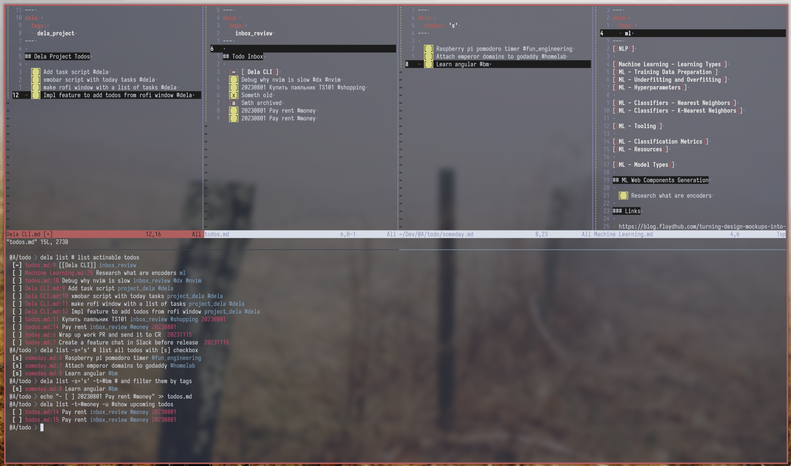

## Dela



### Installation

```
pip install --user dela
```

### Features

- Getting all todos against a markdown files collection
- Dates support
- Tags support
- Flexible filters
- Flexible Sorting
- Frontmatter support


### Examples

```bash
dela list # By default prints all todos with [~], [n] and [ ] checkboxes
dela list -s=' ,s' # prints todos only with statuses [ ] and [s]
dela list --today # prints only todos with default statuses with a date equal or earliear then today
dela list -t=#tag # prints only todos that have tag #tag
dela list -u -s='~,n, ,s' #prints todos with given status including upcoming ones
```

### Help

```
CLI to list todos from markdown files and obsidian vaults.

Usage:
  dela -h | --help
  dela --version
  dela list [-v] [--today|--upcoming] [--all|--statuses=<str>] [--tags=<str>] [--sort_by=<str>] [--format=<str>] [<glob>]


Options:
  -h --help                     Show this screen
  -v --verbose                  Enable logging
  --version                     Show version.

  -s=<str> --statuses=<str>     Filter by status [default: ~,n, ]
  -t=<str> --tags=<str>         Filter by tag (#work, #home, etc)

  --today                       Show only tasks due today or earlier
  -u --upcoming                 Show future tasks
  -a --all                      Show all todos

  --sort_by=<key>               Sort by given key or comma-separated keys

  --format=<string>             Format result with given template string.


Todo statuses:
    Todo status is a symbol placed in the square buckets ([x], [ ], [~], etc). You can use
    whatever you want, `dela` doesn't have eny presets, except default `--status=~,n, `,
    which you can overwrite.


Upcoming Tasks:

    If a task has a date in future, it's hidden by default. To see such tasks in the output,
    add the `--upcoming` flag.


Sorting:

    By default todos are sorted by `--status` value according to the order of given statuses,
    and then by date to place todos with dates to the top of the list (due date sounds important,
    right?). You can sort todos by passing an attribute name to the  `--sort_by` flag.
    Possible values are:

    - title
    - date
    - status
    - tags
    - file


Formatting output:

    You can use your own template with the `--format` flag. Unicode colors are supported:

    For example:

        dela list --format='- [$status] $file: $title'

    Next variables are supported:

    - $title
    - $date
    - $status
    - $tags
    - $file
    - $line

Frontmatter Support:

    You can use frontmatter to override file-level todo states, it can be useful in the next cases:
        - Automatically consider all todos in `todos_done.md` as done
        - To set `date` as `today` automatically if a todo is placed in `today.md`
        - To automatically set per-file tags

    To achieve this, you can add a frontmatter in a manner like below:

    ```
    ---
    dela:
        date: today # it's a specific keyword. Standard dates in a YYYYmmdd format also supported
        status: 'x' # override status for all todos in the file
        tags: # append per-file tags
            - per_file_tag
    ---
    ```
```
